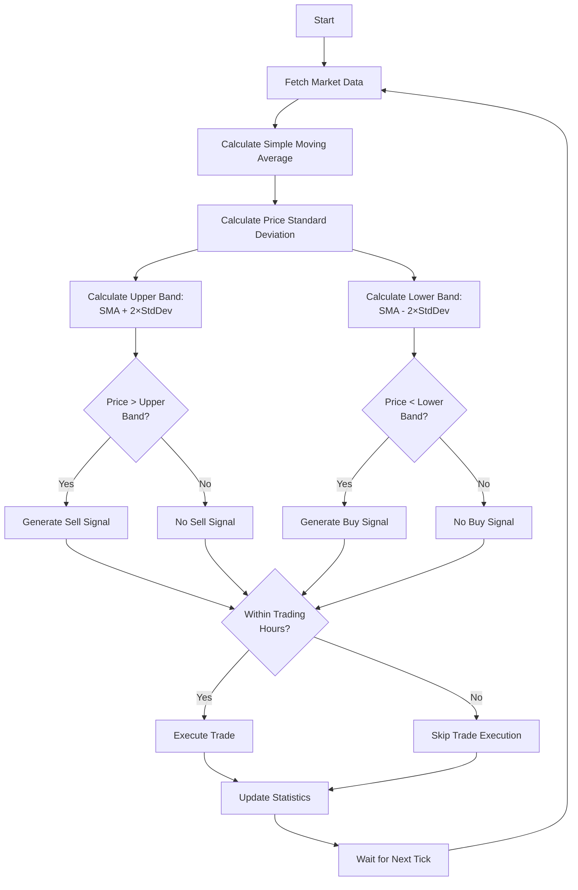

# Bollinger Bands Trading Strategy

!!! danger "Trading Risk Warning"
    **IMPORTANT: All examples should be tested using demo accounts only!**

    - Trading involves substantial risk of loss
    - These examples are for educational purposes only
    - Always test with fake money before using real funds

## Overview

Bollinger Bands are a versatile technical indicator created by John Bollinger that consist of three lines:

| Component | Description |
|-----------|-------------|
| **Middle Band** | A simple moving average (SMA) of the price |
| **Upper Band** | The middle band plus a specific number of standard deviations (typically 2) |
| **Lower Band** | The middle band minus the same number of standard deviations |

This strategy uses a mean reversion approach, which assumes that when prices move significantly away from their average, they tend to return to more normal levels:

| Signal Type | Description |
|-------------|-------------|
| **Buy signal** | When price breaks below the lower band (suggesting the market is oversold) |
| **Sell signal** | When price breaks above the upper band (suggesting the market is overbought) |

## Strategy Logic

| Step | Description |
|------|-------------|
| 1 | Calculate the Bollinger Bands (middle, upper, and lower bands) |
| 2 | Generate buy signals when price falls below the lower band |
| 3 | Generate sell signals when price rises above the upper band |
| 4 | Execute trades only during specified trading hours |

### Strategy Flow



## Code Implementation

Let's break down the implementation step by step:

### Step 1: Required Imports

```python
from __future__ import annotations

import logging
import numpy as np

from mqpy.rates import Rates
from mqpy.tick import Tick
from mqpy.trade import Trade

# Configure logging
logging.basicConfig(
    level=logging.INFO,
    format='%(asctime)s - %(levelname)s - %(message)s'
)
logger = logging.getLogger(__name__)
```

We import the necessary modules:
- Core MQPy modules for trading operations and data access
- `numpy` for efficient calculations of means and standard deviations
- `logging` for detailed tracking of the strategy's operation

### Step 2: Bollinger Bands Calculation Function

```python
def calculate_bollinger_bands(prices: list[float], period: int = 20, num_std_dev: float = 2.0) -> tuple[float, float, float] | None:
    """Calculate Bollinger Bands (middle, upper, lower)."""
    if len(prices) < period:
        return None

    # Convert to numpy array for vectorized calculations
    price_array = np.array(prices[-period:])

    # Calculate SMA (middle band)
    sma = np.mean(price_array)

    # Calculate standard deviation
    std_dev = np.std(price_array)

    # Calculate upper and lower bands
    upper_band = sma + (num_std_dev * std_dev)
    lower_band = sma - (num_std_dev * std_dev)

    return (sma, upper_band, lower_band)
```

This function calculates the three components of the Bollinger Bands:
1. First, it checks if we have enough price data for the specified period
2. It converts the price data into a numpy array for more efficient calculations
3. It calculates the middle band, which is just the simple moving average (SMA) of the prices
4. It calculates the standard deviation of the prices over the specified period
5. It calculates the upper and lower bands by adding/subtracting the standard deviation (multiplied by a factor) from the middle band
6. It returns all three values as a tuple, or `None` if there's not enough data

### Step 3: Initialize the Trading Strategy

```python
trade = Trade(
    expert_name="Bollinger Bands Strategy",
    version="1.0",
    symbol="EURUSD",
    magic_number=569,
    lot=0.1,
    stop_loss=50,
    emergency_stop_loss=150,
    take_profit=100,
    emergency_take_profit=300,
    start_time="9:15",
    finishing_time="17:30",
    ending_time="17:50",
    fee=0.5,
)
```

We configure our trading strategy with:
- Identification parameters: name, version, magic number
- Trading parameters: symbol, lot size
- Risk management parameters: stop loss and take profit (notice the take profit is 2x the stop loss)
- Trading session times: when to start, when to stop opening new positions, and when to close all positions

### Step 4: Set Strategy Parameters

```python
# Strategy parameters
prev_tick_time = 0
bb_period = 20
bb_std_dev = 2.0
```

The key parameters for our Bollinger Bands strategy are:
- `bb_period`: The period for the calculation of the SMA and standard deviation (standard is 20)
- `bb_std_dev`: The number of standard deviations for the bands (standard is 2.0)

### Step 5: Main Trading Loop

```python
try:
    while True:
        # Prepare the symbol for trading
        trade.prepare_symbol()

        # Fetch tick and rates data
        current_tick = Tick(trade.symbol)
        historical_rates = Rates(trade.symbol, bb_period + 10, 0, 1)  # Get extra data for reliability
```

In the main loop, we:
- Prepare the symbol for trading
- Get the current market price
- Retrieve historical price data (we get bb_period + 10 bars for reliable calculations)

### Step 6: Calculate Bollinger Bands

```python
# Only process if we have a new tick
if current_tick.time_msc != prev_tick_time and len(historical_rates.close) >= bb_period:
    # Calculate Bollinger Bands
    bb_result = calculate_bollinger_bands(
        historical_rates.close,
        period=bb_period,
        num_std_dev=bb_std_dev
    )

    if bb_result:
        middle_band, upper_band, lower_band = bb_result
        current_price = current_tick.last
```

For each new tick, we:
- Check that it's different from the previous tick to avoid redundant calculations
- Ensure we have enough historical data
- Calculate the Bollinger Bands using our custom function
- Extract the individual band values and the current price for signal generation

### Step 7: Generate Trading Signals

```python
# Generate signals based on price position relative to bands
# Buy when price crosses below lower band (potential bounce)
is_buy_signal = current_price < lower_band

# Sell when price crosses above upper band (potential reversal)
is_sell_signal = current_price > upper_band

# Log band data and signals
logger.info(f"Current price: {current_price:.5f}")
logger.info(f"Bollinger Bands - Middle: {middle_band:.5f}, Upper: {upper_band:.5f}, Lower: {lower_band:.5f}")

if is_buy_signal:
    logger.info(f"Buy signal: Price ({current_price:.5f}) below lower band ({lower_band:.5f})")
elif is_sell_signal:
    logger.info(f"Sell signal: Price ({current_price:.5f}) above upper band ({upper_band:.5f})")
```

The signal generation logic is based on price comparison with the bands:
1. We generate a buy signal when the current price falls below the lower band
2. We generate a sell signal when the current price rises above the upper band
3. We log the current values of price and bands, as well as any signals generated

### Step 8: Execute Trades

```python
# Execute trading positions based on signals
if trade.trading_time():  # Only trade during allowed hours
    trade.open_position(
        should_buy=is_buy_signal,
        should_sell=is_sell_signal,
        comment="Bollinger Bands Strategy"
    )
```

When a signal is detected:
- We check if we're within the allowed trading hours
- If yes, we execute the appropriate trade based on our signals
- The comment identifies the strategy in the trading terminal

### Step 9: Update State and Check for End of Day

```python
# Update trading statistics
trade.statistics()

prev_tick_time = current_tick.time_msc

# Check if it's the end of the trading day
if trade.days_end():
    trade.close_position("End of the trading day reached.")
    break
```

After processing each tick, we:
- Update the trading statistics for monitoring
- Store the current tick time for the next iteration
- Check if it's the end of the trading day, and if so, close positions and exit

### Step 10: Error Handling

```python
except KeyboardInterrupt:
    logger.info("Strategy execution interrupted by user.")
    trade.close_position("User interrupted the strategy.")
except Exception as e:
    logger.error(f"Error in strategy execution: {e}")
finally:
    logger.info("Finishing the program.")
```

Our error handling ensures:
- Clean exit when the user interrupts the program
- Logging of any errors that occur
- Proper cleanup in the `finally` block

## Full Source Code

You can find the complete source code for this strategy in the [MQPy GitHub repository](https://github.com/Joaopeuko/Mql5-Python-Integration/blob/main/docs/examples/bollinger_bands_strategy.py).

## Optimization Opportunities

This strategy can be improved by:

| Improvement | Description |
|-------------|-------------|
| **Trend Filter** | Using a longer-term moving average to only take trades in the direction of the overall trend |
| **Band Width Analysis** | Trading based on the width of the bands (narrowing and widening) to identify volatility changes |
| **Band Touch Strategy** | Waiting for the price to return to the middle band after touching an outer band |
| **Volume Confirmation** | Using volume information to confirm potential reversals |
| **Dynamic Deviation** | Adjusting the number of standard deviations based on market volatility |

## Next Steps

Try experimenting with:

| Experiment | Options |
|------------|---------|
| Period Length | Shorter periods for more signals, longer periods for fewer but stronger signals |
| Standard Deviation | Higher values (2.5 or 3.0) for fewer but more reliable signals |
| Indicator Combinations | Combine with momentum indicators like RSI to confirm signals |
| Entry Refinement | Wait for reversal candle patterns after price breaks a band before entering |
