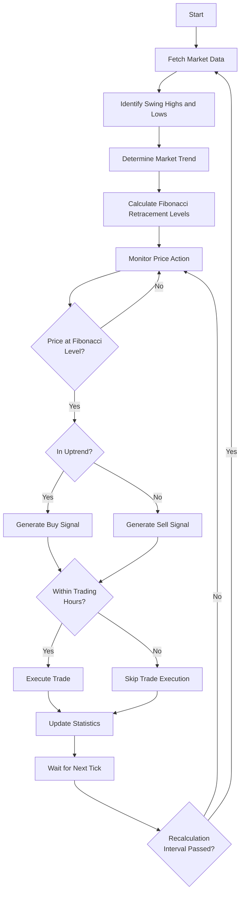

# Fibonacci Retracement Trading Strategy

!!! danger "Trading Risk Warning"
    **IMPORTANT: All examples should be tested using demo accounts only!**

    - Trading involves substantial risk of loss
    - These examples are for educational purposes only
    - Always test with fake money before using real funds

## Overview

The Fibonacci Retracement strategy is based on the mathematical sequence discovered by Leonardo Fibonacci. In financial markets, traders use Fibonacci ratios to identify potential reversal levels after a significant price movement.

| Retracement Level | Description |
|-------------------|-------------|
| **0.0%** | The starting point of the move |
| **23.6%** | Minor retracement level |
| **38.2%** | Moderate retracement level, often significant |
| **50.0%** | Not a Fibonacci ratio but widely used in trading |
| **61.8%** | The Golden Ratio, typically the strongest level |
| **78.6%** | Deep retracement, often the last level before reversal |
| **100.0%** | Complete retracement to the starting point |

This strategy identifies significant swing points in the market, calculates Fibonacci levels between them, and trades when price interacts with these levels.

| Signal Type | Description |
|-------------|-------------|
| **Buy signal** | When price bounces off a Fibonacci retracement level during an uptrend |
| **Sell signal** | When price bounces off a Fibonacci retracement level during a downtrend |

## Strategy Logic

| Step | Description |
|------|-------------|
| 1 | Identify significant swing highs and lows in the price data |
| 2 | Calculate Fibonacci retracement levels between the most recent swing points |
| 3 | Determine if the market is in an uptrend or downtrend |
| 4 | Generate buy signals when price bounces off Fibonacci levels during uptrends |
| 5 | Generate sell signals when price bounces off Fibonacci levels during downtrends |
| 6 | Visualize price action with Fibonacci levels for analysis |

### Strategy Flow



## Code Implementation

Let's break down the implementation step by step:

### Step 1: Required Imports

```python
from __future__ import annotations

import logging
import matplotlib.pyplot as plt
import numpy as np
import pandas as pd
from mpl_finance import candlestick_ohlc
import matplotlib.dates as mdates

import MetaTrader5 as Mt5

from mqpy.rates import Rates
from mqpy.tick import Tick
from mqpy.trade import Trade

# Configure logging
logging.basicConfig(
    level=logging.INFO,
    format='%(asctime)s - %(levelname)s - %(message)s'
)
logger = logging.getLogger(__name__)

# Fibonacci retracement levels (standard)
FIBONACCI_LEVELS = [0.0, 0.236, 0.382, 0.5, 0.618, 0.786, 1.0]
```

We import the necessary modules:
- Core MQPy modules for trading operations and data access
- Visualization libraries for creating charts with Fibonacci levels
- `numpy` and `pandas` for data manipulation
- Type hints for better code readability
- The standard Fibonacci levels are defined as a constant

### Step 2: Swing Point Detection Function

```python
def find_swing_points(prices: list[float], window: int = 5) -> tuple[list[int], list[int]]:
    """Find swing high and swing low points in price data.

    Args:
        prices: List of price values
        window: Window size for determining swing points

    Returns:
        Tuple containing lists of swing high and swing low indices
    """
    highs: list[int] = []
    lows: list[int] = []

    if len(prices) < 2 * window + 1:
        return highs, lows

    for i in range(window, len(prices) - window):
        # Check for swing high
        if all(prices[i] > prices[i-j] for j in range(1, window+1)) and \
           all(prices[i] > prices[i+j] for j in range(1, window+1)):
            highs.append(i)

        # Check for swing low
        if all(prices[i] < prices[i-j] for j in range(1, window+1)) and \
           all(prices[i] < prices[i+j] for j in range(1, window+1)):
            lows.append(i)

    return highs, lows
```

This function identifies swing highs and lows in the price data:
1. It takes a list of prices and a window parameter that determines how significant a swing point needs to be
2. It checks each price point to see if it's higher than all points within the window (for highs) or lower than all points within the window (for lows)
3. It returns two lists containing the indices of the identified swing highs and lows

### Step 3: Fibonacci Level Calculation

```python
def calculate_fibonacci_levels(start_price: float, end_price: float) -> dict[float, float]:
    """Calculate Fibonacci retracement price levels.

    Args:
        start_price: Starting price for retracement (swing high/low)
        end_price: Ending price for retracement (swing low/high)

    Returns:
        Dictionary mapping Fibonacci ratios to price levels
    """
    diff = end_price - start_price
    levels = {}

    for ratio in FIBONACCI_LEVELS:
        levels[ratio] = start_price + diff * ratio

    return levels
```

This function calculates the actual Fibonacci retracement levels:
1. It takes the starting and ending price points (typically swing high and low)
2. It calculates the price difference between them
3. It applies each Fibonacci ratio to the price difference to determine the retracement levels
4. It returns a dictionary mapping the ratios to the corresponding price levels

### Step 4: Visualization Function

```python
def plot_fibonacci_levels(
    rates: Rates,
    swing_highs: list[int],
    swing_lows: list[int],
    retracement_levels: dict[float, float] | None = None
) -> None:
    """Plot price chart with swing points and Fibonacci retracement levels.

    Args:
        rates: Rate data containing OHLC prices and times
        swing_highs: Indices of swing high points
        swing_lows: Indices of swing low points
        retracement_levels: Dictionary of Fibonacci levels to plot
    """
    try:
        # Convert rates data to pandas DataFrame
        data = []
        for i in range(len(rates.time)):
            # Convert to matplotlib date format
            date = mdates.date2num(pd.to_datetime(rates.time[i], unit='s'))
            data.append([date, rates.open[i], rates.high[i], rates.low[i], rates.close[i]])

        df = pd.DataFrame(data, columns=['Date', 'Open', 'High', 'Low', 'Close'])

        # Create plot
        fig, ax = plt.subplots(figsize=(12, 8))

        # Plot candlestick chart
        candlestick_ohlc(ax, df.values, width=0.001, colorup='green', colordown='red', alpha=0.8)

        # Format date axis
        ax.xaxis.set_major_formatter(mdates.DateFormatter('%Y-%m-%d %H:%M'))
        plt.xticks(rotation=45)

        # Mark swing highs and lows
        for idx in swing_highs:
            ax.plot(mdates.date2num(pd.to_datetime(rates.time[idx], unit='s')),
                   rates.high[idx], 'ro', markersize=8)

        for idx in swing_lows:
            ax.plot(mdates.date2num(pd.to_datetime(rates.time[idx], unit='s')),
                   rates.low[idx], 'go', markersize=8)

        # Plot Fibonacci retracement levels if provided
        if retracement_levels:
            colors = ['b', 'g', 'r', 'c', 'm', 'y', 'k']
            for i, (ratio, price) in enumerate(retracement_levels.items()):
                ax.axhline(y=price, color=colors[i % len(colors)], linestyle='--',
                          label=f'Fib {ratio:.3f}: {price:.5f}')

        plt.title('EURUSD with Fibonacci Retracement Levels')
        plt.ylabel('Price')
        plt.legend()
        plt.tight_layout()

        # Save the chart
        plt.savefig('fibonacci_retracement.png')
        logger.info("Chart saved as 'fibonacci_retracement.png'")

        plt.close()

    except Exception:
        logger.exception("Error creating Fibonacci retracement chart")
```

This visualization function creates a candlestick chart with the Fibonacci levels:
1. It converts the price data to a pandas DataFrame
2. It creates a candlestick chart of the price action
3. It marks the identified swing highs and lows with colored dots
4. It draws horizontal lines for each Fibonacci retracement level
5. It saves the chart to a file for analysis

### Step 5: Signal Generation Function

```python
def analyze_retracement_signals(
    current_price: float,
    fib_levels: dict[float, float],
    tolerance: float = 0.0001
) -> tuple[bool, bool, Optional[float]]:
    """Analyze price position relative to Fibonacci levels and generate signals.

    Args:
        current_price: Current market price
        fib_levels: Dictionary of Fibonacci retracement levels
        tolerance: Price tolerance for level testing

    Returns:
        Tuple containing (buy_signal, sell_signal, level_tested)
    """
    buy_signal = False
    sell_signal = False
    level_tested = None

    # Determine trend direction from Fibonacci levels
    uptrend = fib_levels[0.0] < fib_levels[1.0]

    for ratio, level in fib_levels.items():
        # Check if price is near a Fibonacci level
        if abs(current_price - level) < tolerance:
            level_tested = ratio

            # In uptrend, bounces off retracement levels can be buy signals
            # Focus on the most reliable levels: 0.382, 0.5, 0.618
            if uptrend and ratio in [0.382, 0.5, 0.618]:
                buy_signal = True

            # In downtrend, bounces off retracement levels can be sell signals
            elif not uptrend and ratio in [0.382, 0.5, 0.618]:
                sell_signal = True

            break

    return buy_signal, sell_signal, level_tested
```

This function analyzes the current price in relation to the Fibonacci levels:
1. It checks if the current price is close to any Fibonacci level (within a specified tolerance)
2. It determines if the market is in an uptrend or downtrend based on the direction of the Fibonacci levels
3. It generates buy signals during uptrends and sell signals during downtrends
4. It focuses on the most statistically significant levels (38.2%, 50%, 61.8%)
5. It returns the signals and the specific level being tested

### Step 6: Initialize the Trading Strategy

```python
trade = Trade(
    expert_name="Fibonacci Retracement Strategy",
    version="1.0",
    symbol="EURUSD",
    magic_number=571,
    lot=0.1,
    stop_loss=35,
    emergency_stop_loss=100,
    take_profit=70,
    emergency_take_profit=200,
    start_time="9:15",
    finishing_time="17:30",
    ending_time="17:50",
    fee=0.5,
)
```

We initialize the trading parameters with:
- EURUSD as the trading instrument
- A magic number of 571 to identify this strategy's trades
- Stop loss and take profit levels (note that take profit is 2x the stop loss for a positive risk-reward ratio)
- Trading session times that limit when trades can be executed

### Step 7: Main Trading Loop

```python
# Strategy parameters
prev_tick_time = 0
lookback_period = 100  # Number of candles to analyze
swing_window = 5       # Window for swing high/low detection
price_tolerance = 0.0001  # Tolerance for testing price at Fibonacci levels

# Variables to track state
current_fib_levels = None
last_swing_check_time = 0
swing_recalculation_interval = 10 * 60  # Recalculate swings every 10 minutes

try:
    while True:
        # Prepare the symbol for trading
        trade.prepare_symbol()

        # Fetch tick and rates data (H1 timeframe for identifying swings)
        current_tick = Tick(trade.symbol)
        historical_rates = Rates(trade.symbol, lookback_period, 0, 60)  # H1 timeframe

        current_time = current_tick.time
```

In the main loop:
- We set up strategy parameters, including how many candles to analyze and how sensitive the swing detection should be
- We initialize state tracking variables for the Fibonacci levels and when to recalculate them
- We prepare the symbol for trading and fetch the current price and historical data
- We use a 1-hour timeframe (60 minutes) for identifying swing points

### Step 8: Swing Point and Fibonacci Level Calculation

```python
# Only recalculate swing points and Fibonacci levels periodically
if (current_time - last_swing_check_time) > swing_recalculation_interval:
    # Find swing highs and lows
    swing_highs, swing_lows = find_swing_points(historical_rates.close, window=swing_window)

    # Calculate Fibonacci levels if we have swing points
    if len(swing_highs) > 0 and len(swing_lows) > 0:
        # Use the most recent swing high and swing low
        recent_high_idx = swing_highs[-1]
        recent_low_idx = swing_lows[-1]

        # Determine which one is more recent
        if recent_high_idx > recent_low_idx:
            # Downtrend: from high to low
            start_price = historical_rates.high[recent_high_idx]
            end_price = historical_rates.low[recent_low_idx]
            logger.info(f"Detected downtrend from {start_price:.5f} to {end_price:.5f}")
        else:
            # Uptrend: from low to high
            start_price = historical_rates.low[recent_low_idx]
            end_price = historical_rates.high[recent_high_idx]
            logger.info(f"Detected uptrend from {start_price:.5f} to {end_price:.5f}")

        # Calculate Fibonacci retracement levels
        current_fib_levels = calculate_fibonacci_levels(start_price, end_price)

        # Log Fibonacci levels
        logger.info("Fibonacci retracement levels:")
        for ratio, price in current_fib_levels.items():
            logger.info(f"  {ratio:.3f}: {price:.5f}")

        # Create and save Fibonacci retracement chart
        plot_fibonacci_levels(historical_rates, swing_highs, swing_lows, current_fib_levels)

        last_swing_check_time = current_time
```

We recalculate swing points and Fibonacci levels periodically:
1. This saves processing power and avoids too-frequent changes in the levels
2. We find swing highs and lows using our defined function
3. We identify the most recent swing high and low to use for calculating Fibonacci levels
4. We determine if the market is in an uptrend or downtrend based on which swing point is more recent
5. We calculate the Fibonacci levels, log them, and create a visual chart

### Step 9: Signal Generation and Trading

```python
# Only process trading logic if we have new tick data and Fibonacci levels
if current_tick.time_msc != prev_tick_time and current_fib_levels:
    # Current price
    current_price = current_tick.ask  # Use ask price for analysis

    # Analyze price relative to Fibonacci levels
    buy_signal, sell_signal, level_tested = analyze_retracement_signals(
        current_price, current_fib_levels, tolerance=price_tolerance
    )

    # Log signals
    if level_tested is not None:
        logger.info(f"Price {current_price:.5f} testing Fibonacci level {level_tested:.3f}")

        if buy_signal:
            logger.info(f"Buy signal generated at Fibonacci level {level_tested:.3f}")
        elif sell_signal:
            logger.info(f"Sell signal generated at Fibonacci level {level_tested:.3f}")

    # Execute trading based on signals
    if trade.trading_time():  # Only trade during allowed hours
        trade.open_position(
            should_buy=buy_signal,
            should_sell=sell_signal,
            comment=f"Fibonacci {level_tested:.3f} Strategy" if level_tested is not None else "Fibonacci Strategy"
        )

    # Update trading statistics
    trade.statistics()

    prev_tick_time = current_tick.time_msc
```

For each new tick:
1. We analyze the current price in relation to the calculated Fibonacci levels
2. We generate buy or sell signals based on price interaction with the levels
3. We log detailed information about which level is being tested and which signal is generated
4. We execute trades only during the allowed trading hours
5. We include the specific Fibonacci level in the trade comment for reference

### Step 10: End of Day Handling and Error Management

```python
# Check if it's the end of the trading day
if trade.days_end():
    trade.close_position("End of the trading day reached.")
    break

except KeyboardInterrupt:
    logger.info("Strategy execution interrupted by user.")
    trade.close_position("User interrupted the strategy.")
except Exception:
    logger.exception("Error in strategy execution")
finally:
    logger.info("Finishing the program.")
```

We include proper handling for:
- End of trading day detection and position closure
- User interruptions through keyboard input
- Exceptions with detailed logging
- Cleanup operations in the finally block

## Potential Enhancements

The Fibonacci Retracement strategy can be improved with:

1. **Volume Confirmation**: Add volume analysis to confirm price reactions at Fibonacci levels
2. **Multiple Timeframe Analysis**: Incorporate Fibonacci levels from higher timeframes for stronger confluence
3. **Trend Filter**: Add a trend indicator to avoid counter-trend trades
4. **Pattern Recognition**: Integrate candlestick pattern recognition at Fibonacci levels
5. **Dynamic Stop-Loss**: Implement trailing stops based on the identified swing points

## Conclusion

The Fibonacci Retracement strategy combines ancient mathematical principles with modern algorithmic trading. By identifying swing points and calculating retracement levels, it provides a systematic way to find potential reversal points in the market.

While not a perfect prediction tool, when combined with proper risk management and additional confirmation factors, it can be a valuable addition to a trader's arsenal of strategies.
