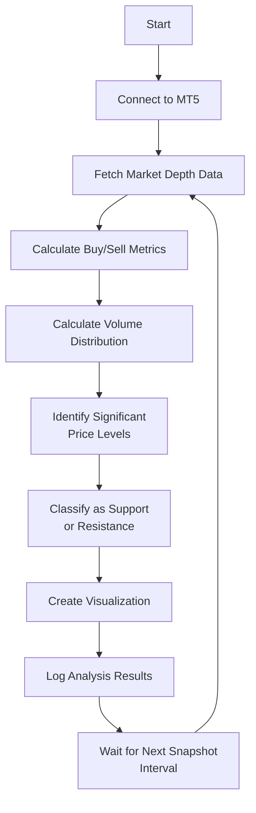

# Market Depth Analysis Strategy

!!! danger "Trading Risk Warning"
    **IMPORTANT: All examples should be tested using demo accounts only!**

    - Trading involves substantial risk of loss
    - These examples are for educational purposes only
    - Always test with fake money before using real funds

## Overview

Market Depth Analysis (also known as DOM or Depth of Market analysis) examines the order book data to understand supply and demand dynamics that aren't visible on price charts alone. This approach allows traders to:

1. See the actual buy and sell orders waiting to be executed at various price levels
2. Identify potential support and resistance levels based on order concentration
3. Gauge market sentiment through imbalances in buy and sell orders
4. Anticipate potential price movements based on order flow patterns

Market depth data consists of:

| Component | Description |
|-----------|-------------|
| **Buy Orders (Bids)** | Orders to buy at specific prices, appearing below current market price |
| **Sell Orders (Asks)** | Orders to sell at specific prices, appearing above current market price |
| **Volume** | The quantity associated with each order at a particular price level |

This analysis tool doesn't generate direct trading signals but provides valuable context for making informed trading decisions.

## Analysis Logic

| Step | Description |
|------|-------------|
| 1 | Connect to MetaTrader 5 and retrieve order book (market depth) data |
| 2 | Analyze buy/sell order distribution and calculate key metrics |
| 3 | Identify price levels with unusually high order concentration |
| 4 | Visualize the order book structure and highlight significant levels |
| 5 | Track changes in order book structure over time |

### Analysis Flow



## Code Implementation

Let's break down the implementation step by step:

### Step 1: Required Imports

```python
from __future__ import annotations

import logging
import time

import matplotlib.pyplot as plt

from mqpy.tick import MqlBookInfo, Tick
from mqpy.trade import Trade

# Configure logging
logging.basicConfig(level=logging.INFO, format="%(asctime)s - %(levelname)s - %(message)s")
logger = logging.getLogger(__name__)
```

We import the necessary modules:
- Core MQPy modules for accessing market data and trading functionality
- `matplotlib` for visualizing the market depth data
- `logging` for tracking the analysis process
- Type hints for better code readability

### Step 2: Market Depth Analysis Function

```python
def analyze_market_depth(book_info: list[MqlBookInfo]) -> tuple[dict[str, float], dict[float, int]]:
    """Analyze market depth information to extract trading insights.

    Args:
        book_info: List of MqlBookInfo objects containing the market depth data

    Returns:
        Tuple containing market metrics and volume distribution by price
    """
    if not book_info:
        logger.warning("Empty market depth data received")
        return {}, {}

    # Initialize counters
    buy_volume = 0
    sell_volume = 0
    buy_orders = 0
    sell_orders = 0

    # Dictionary to track volume at each price level
    volume_by_price: dict[float, int] = {}

    # Process each entry in the order book
    for entry in book_info:
        # Track volume by price
        volume_by_price[entry.price] = volume_by_price.get(entry.price, 0) + entry.volume

        if entry.type == 1:  # Buy orders (bids)
            buy_volume += entry.volume
            buy_orders += 1
        elif entry.type == 2:  # Sell orders (asks)
            sell_volume += entry.volume
            sell_orders += 1

    # Calculate market metrics
    total_volume = buy_volume + sell_volume
    buy_percentage = (buy_volume / total_volume) * 100 if total_volume > 0 else 0
    sell_percentage = (sell_volume / total_volume) * 100 if total_volume > 0 else 0

    # Calculate buy/sell ratio
    buy_sell_ratio = buy_volume / sell_volume if sell_volume > 0 else float("inf")

    # Package results
    metrics = {
        "buy_volume": buy_volume,
        "sell_volume": sell_volume,
        "buy_orders": buy_orders,
        "sell_orders": sell_orders,
        "buy_percentage": buy_percentage,
        "sell_percentage": sell_percentage,
        "buy_sell_ratio": buy_sell_ratio,
        "total_orders": buy_orders + sell_orders,
        "total_volume": total_volume,
    }

    return metrics, volume_by_price
```

This function analyzes the raw order book data:
1. It processes each entry in the market depth to track buy and sell volumes
2. It maintains a dictionary that maps price levels to their total volume
3. It calculates key metrics including buy/sell ratio and percentage distribution
4. It returns both the summary metrics and the volume distribution for further analysis

### Step 3: Support/Resistance Detection Function

```python
def identify_support_resistance(
    volume_by_price: dict[float, int], threshold_factor: float = 1.5
) -> list[dict[str, Any]]:
    """Identify potential support and resistance levels based on volume concentration.

    Args:
        volume_by_price: Dictionary mapping price levels to their volume
        threshold_factor: Multiplier for the average volume to identify significant levels

    Returns:
        List of dictionaries containing identified support/resistance levels
    """
    if not volume_by_price:
        return []

    # Calculate average volume
    volumes = list(volume_by_price.values())
    avg_volume = sum(volumes) / len(volumes)
    threshold = avg_volume * threshold_factor

    # Find price levels with volume above threshold
    significant_levels = []

    # Sort price levels for easier analysis
    sorted_prices = sorted(volume_by_price.keys())

    for price in sorted_prices:
        volume = volume_by_price[price]
        if volume > threshold:
            # Determine if this is likely support or resistance
            # This is a simplistic approach - in reality, you'd need more context
            # We'll use a simple heuristic based on position in the order book
            median_price = sorted_prices[len(sorted_prices) // 2]
            level_type = "support" if price < median_price else "resistance"

            significant_levels.append(
                {
                    "price": price,
                    "volume": volume,
                    "type": level_type,
                    "strength": volume / avg_volume,  # Relative strength factor
                }
            )

    return significant_levels
```

This function identifies potential support and resistance levels:
1. It calculates the average volume across all price levels
2. It identifies price levels with volume significantly above average (using a threshold factor)
3. It classifies each level as support or resistance based on its position relative to the median price
4. It calculates a "strength" factor for each level based on how much its volume exceeds the average
5. It returns a list of identified levels with their characteristics

### Step 4: Visualization Function

```python
def plot_market_depth(book_info: list[MqlBookInfo], metrics: dict[str, float], levels: list[dict[str, Any]]) -> None:
    """Visualize market depth data and identified support/resistance levels.

    Args:
        book_info: List of MqlBookInfo objects containing the market depth data
        metrics: Dictionary of market metrics from analyze_market_depth
        levels: List of identified support/resistance levels
    """
    try:
        # Extract data for plotting
        buy_prices = []
        buy_volumes = []
        sell_prices = []
        sell_volumes = []

        for entry in book_info:
            if entry.type == 1:  # Buy orders
                buy_prices.append(entry.price)
                buy_volumes.append(entry.volume)
            elif entry.type == 2:  # Sell orders
                sell_prices.append(entry.price)
                sell_volumes.append(entry.volume)

        # Create the plot
        plt.figure(figsize=(12, 8))

        # Plot buy orders (bids) in green
        plt.barh(buy_prices, buy_volumes, color="green", alpha=0.6, label="Bids (Buy Orders)")

        # Plot sell orders (asks) in red
        plt.barh(sell_prices, sell_volumes, color="red", alpha=0.6, label="Asks (Sell Orders)")

        # Highlight support/resistance levels
        for level in levels:
            plt.axhline(
                y=level["price"],
                color="purple",
                linestyle="--",
                alpha=0.7,
                label=f"{level['type'].capitalize()} ({level['price']})",
            )

        # Add labels and title
        plt.title(f"Market Depth Analysis\nBuy/Sell Ratio: {metrics['buy_sell_ratio']:.2f}", fontsize=14)
        plt.xlabel("Volume", fontsize=12)
        plt.ylabel("Price", fontsize=12)
        plt.grid(True, alpha=0.3)

        # Add buy/sell percentage annotation
        annotation_text = (
            f"Buy Volume: {metrics['buy_volume']} ({metrics['buy_percentage']:.1f}%)\n"
            f"Sell Volume: {metrics['sell_volume']} ({metrics['sell_percentage']:.1f}%)\n"
            f"Total Orders: {metrics['total_orders']}"
        )
        plt.annotate(
            annotation_text,
            xy=(0.02, 0.02),
            xycoords="axes fraction",
            bbox=dict(boxstyle="round,pad=0.5", fc="white", alpha=0.8),
        )

        # Clean up the legend (limit to unique entries)
        handles, labels = plt.gca().get_legend_handles_labels()
        by_label = dict(zip(labels, handles))
        plt.legend(by_label.values(), by_label.keys(), loc="best")

        # Save the plot
        plt.tight_layout()
        plt.savefig("market_depth_analysis.png")
        logger.info("Market depth visualization saved as 'market_depth_analysis.png'")
        plt.close()
    except Exception:
        logger.exception("Error creating market depth visualization")
```

This visualization function creates a horizontal bar chart of the order book:
1. It separates buy and sell orders for plotting
2. It creates a horizontal bar chart with buy orders in green and sell orders in red
3. It highlights identified support/resistance levels with horizontal lines
4. It adds annotations with key metrics like buy/sell ratio and percentages
5. It saves the visualization to a file for later analysis

### Step 5: Initialize the Trade Object

```python
trade = Trade(
    expert_name="Market Depth Analyzer",
    version="1.0",
    symbol="EURUSD",
    magic_number=573,
    lot=0.1,
    stop_loss=30,
    emergency_stop_loss=90,
    take_profit=60,
    emergency_take_profit=180,
    start_time="9:15",
    finishing_time="17:30",
    ending_time="17:50",
    fee=0.5,
)
```

We initialize the Trade object to:
- Identify our analysis tool with a name and version
- Specify the trading instrument (EURUSD)
- Set a unique magic number
- Configure risk management parameters (even though this is primarily an analysis tool, not a trading strategy)
- Define session trading hours

### Step 6: Main Analysis Loop

```python
# Previous tick time to track new ticks
prev_tick_time = 0

# Track depth changes
depth_snapshots: list[list[MqlBookInfo]] = []
snapshot_timestamps: list[int] = []
last_snapshot_time = 0

try:
    # Main loop
    while True:
        # Prepare the symbol for trading
        trade.prepare_symbol()

        # Fetch current tick data
        current_tick = Tick(trade.symbol)

        # Only process if we have a new tick
        if current_tick.time_msc != prev_tick_time:
            try:
                # Get market depth data
                book_info = current_tick.get_book()
```

In the main loop:
- We initialize variables to track tick times and store snapshots
- We prepare the symbol and get the current tick data
- We only process new ticks to avoid redundant calculations
- We retrieve the current market depth (order book) data

### Step 7: Snapshot Collection and Analysis

```python
# Check if we have valid market depth data
if book_info and len(book_info) > 0:
    # Take snapshots at regular intervals (every 10 seconds)
    current_time = int(time.time())
    if current_time - last_snapshot_time >= 10:
        # Store the snapshot
        depth_snapshots.append(book_info)
        snapshot_timestamps.append(current_time)
        last_snapshot_time = current_time

        # Keep only the last 10 snapshots
        if len(depth_snapshots) > 10:
            depth_snapshots.pop(0)
            snapshot_timestamps.pop(0)

        # Analyze the current market depth
        metrics, volume_by_price = analyze_market_depth(book_info)

        # Log key metrics
        logger.info(
            f"Market depth snapshot at {time.strftime('%H:%M:%S', time.localtime(current_time))}"
        )
        logger.info(f"Buy/Sell Ratio: {metrics['buy_sell_ratio']:.2f}")
        logger.info(f"Buy Volume: {metrics['buy_volume']} ({metrics['buy_percentage']:.1f}%)")
        logger.info(f"Sell Volume: {metrics['sell_volume']} ({metrics['sell_percentage']:.1f}%)")
```

We collect and analyze market depth snapshots:
1. We take snapshots at regular intervals (every 10 seconds)
2. We maintain a rolling history of the last 10 snapshots
3. We analyze each snapshot to calculate key metrics
4. We log the results for monitoring

### Step 8: Support/Resistance Identification and Visualization

```python
# Identify potential support and resistance levels
levels = identify_support_resistance(volume_by_price)

if levels:
    logger.info("Potential support/resistance levels:")
    for level in levels:
        logger.info(
            f"{level['type'].capitalize()} at {level['price']} "
            f"(strength: {level['strength']:.1f}x average)"
        )

# Create a visualization every 30 seconds
if len(depth_snapshots) % 3 == 0:
    plot_market_depth(book_info, metrics, levels)
```

For each analyzed snapshot:
1. We identify potential support and resistance levels
2. We log the identified levels with their characteristics
3. We create a visualization every 30 seconds (every 3rd snapshot)

### Step 9: Error Handling and Shutdown

```python
except Exception:
    logger.exception("Error processing market depth data")

# Update previous tick time
prev_tick_time = current_tick.time_msc

# Check if it's the end of the trading day
if trade.days_end():
    logger.info("End of trading day reached.")
    break

# Add a short delay to avoid excessive CPU usage
time.sleep(0.1)

except KeyboardInterrupt:
    logger.info("Analysis interrupted by user")
except Exception:
    logger.exception("Error in market depth analysis")
finally:
    logger.info("Finishing market depth analysis")

    # Create a final visualization if we have data
    if depth_snapshots:
        try:
            # Analyze the most recent snapshot
            metrics, volume_by_price = analyze_market_depth(depth_snapshots[-1])
            levels = identify_support_resistance(volume_by_price)
            plot_market_depth(depth_snapshots[-1], metrics, levels)
            logger.info("Final market depth visualization saved")
        except Exception:
            logger.exception("Error creating final visualization")
```

We implement comprehensive error handling:
1. We catch and log exceptions during market depth processing
2. We check for the end of the trading day
3. We handle user interruptions
4. We create a final visualization before shutting down

## Interpreting the Results

The Market Depth analysis provides several key insights:

| Metric | Interpretation |
|--------|----------------|
| **Buy/Sell Ratio > 1.0** | Indicates stronger buying pressure; potentially bullish |
| **Buy/Sell Ratio < 1.0** | Indicates stronger selling pressure; potentially bearish |
| **Strong Support Level** | A price level with high buy order concentration; may prevent price from falling further |
| **Strong Resistance Level** | A price level with high sell order concentration; may prevent price from rising further |
| **Level Strength** | How significant a support/resistance level is compared to average (higher is stronger) |

## Practical Applications

Here are some ways to apply market depth analysis to your trading:

1. **Confirmation Tool**: Use identified support/resistance levels to confirm technical analysis from price charts.

2. **Entry/Exit Timing**: Watch how price interacts with levels of high order concentration for optimal trade timing.

3. **Stop-Loss Placement**: Set stops beyond significant support/resistance levels that have high order volume.

4. **Market Sentiment**: Track buy/sell ratio changes over time to gauge shifts in market sentiment.

5. **Spotting Manipulation**: Unusually large orders or sudden changes in the order book may indicate institutional activity.

## Conclusion

Market Depth Analysis provides a window into the supply and demand dynamics that drive price movement. By examining the actual order book data rather than just price action, traders can gain valuable insights into market structure and sentiment.

While not a standalone trading strategy, this analysis tool can significantly enhance trading decisions when combined with other technical and fundamental approaches. It's particularly valuable for short-term traders who need to understand immediate market dynamics and liquidity conditions.
