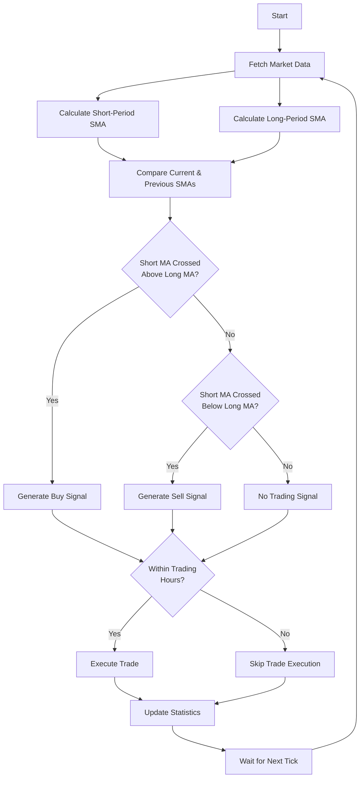

# Moving Average Crossover Strategy

!!! danger "Trading Risk Warning"
    **IMPORTANT: All examples should be tested using demo accounts only!**

    - Trading involves substantial risk of loss
    - These examples are for educational purposes only
    - Always test with fake money before using real funds

## Overview

The Moving Average Crossover is one of the most widely used trading strategies in technical analysis. It uses two moving averages of different periods to generate trading signals:

| Signal Type | Description |
|-------------|-------------|
| **Buy signal** | When the faster (shorter-period) moving average crosses above the slower (longer-period) moving average |
| **Sell signal** | When the faster moving average crosses below the slower moving average |

This strategy aims to identify potential trend changes in the market.

## Strategy Logic

| Step | Description |
|------|-------------|
| 1 | Calculate two Simple Moving Averages (SMA): a short-period SMA and a long-period SMA |
| 2 | Compare current and previous values of both SMAs to detect crossovers |
| 3 | Generate buy signals when short SMA crosses above long SMA |
| 4 | Generate sell signals when short SMA crosses below long SMA |
| 5 | Execute trades only during specified trading hours |

### Strategy Flow



## Code Implementation

Let's break down the implementation step by step:

### Step 1: Required Imports

```python
from __future__ import annotations

import logging

from mqpy.rates import Rates
from mqpy.tick import Tick
from mqpy.trade import Trade

# Configure logging
logging.basicConfig(
    level=logging.INFO,
    format='%(asctime)s - %(levelname)s - %(message)s'
)
logger = logging.getLogger(__name__)
```

We import the necessary modules from MQPy:
- `Rates`: For accessing historical price data
- `Tick`: For accessing current market prices
- `Trade`: For executing trading operations
- `logging`: For keeping track of what the strategy is doing

### Step 2: Define SMA Calculation Function

```python
def calculate_sma(prices: list[float], period: int) -> float | None:
    """Calculate Simple Moving Average."""
    if len(prices) < period:
        return None
    return sum(prices[-period:]) / period
```

This function calculates a Simple Moving Average (SMA) from a list of prices:
- It first checks if we have enough price data for the requested period
- If not, it returns `None`
- Otherwise, it calculates the average of the last `period` prices

### Step 3: Initialize the Trading Strategy

```python
trade = Trade(
    expert_name="Moving Average Crossover",
    version="1.0",
    symbol="EURUSD",
    magic_number=567,
    lot=0.1,
    stop_loss=25,
    emergency_stop_loss=300,
    take_profit=25,
    emergency_take_profit=300,
    start_time="9:15",
    finishing_time="17:30",
    ending_time="17:50",
    fee=0.5,
)
```

Here we initialize the `Trade` object with our strategy parameters:
- `expert_name`: The name of our trading strategy
- `symbol`: The trading instrument (EURUSD in this case)
- `magic_number`: A unique identifier for this strategy's trades
- `lot`: The trading volume
- `stop_loss`/`take_profit`: Risk management parameters in points
- `emergency_stop_loss`/`emergency_take_profit`: Larger safety values if regular ones fail
- `start_time`/`finishing_time`/`ending_time`: Define the trading session hours

### Step 4: Set Strategy Parameters

```python
# Strategy parameters
prev_tick_time = 0
short_period = 5
long_period = 20

# Variables to track previous state for crossover detection
prev_short_ma = None
prev_long_ma = None
```

We define the key parameters for our strategy:
- `short_period`: The period for the fast moving average (5 bars)
- `long_period`: The period for the slow moving average (20 bars)
- We also initialize variables to track the previous MA values for crossover detection

### Step 5: Main Trading Loop

```python
try:
    while True:
        # Prepare the symbol for trading
        trade.prepare_symbol()

        # Fetch tick and rates data
        current_tick = Tick(trade.symbol)
        historical_rates = Rates(trade.symbol, long_period + 10, 0, 1)  # Get extra data for reliability
```

The main loop:
- Prepares the symbol for trading
- Gets the current market price via `Tick`
- Retrieves historical price data via `Rates`. We request slightly more data (long_period + 10) for reliability

### Step 6: Calculate Moving Averages

```python
# Only process if we have a new tick
if current_tick.time_msc != prev_tick_time and len(historical_rates.close) >= long_period:
    # Calculate moving averages
    short_ma = calculate_sma(historical_rates.close, short_period)
    long_ma = calculate_sma(historical_rates.close, long_period)
```

For each new tick:
- We check that it's different from the previous tick to avoid redundant calculations
- We ensure we have enough historical data
- We calculate both the short and long moving averages

### Step 7: Detect Crossovers

```python
# Check if we have enough data for comparison
if short_ma and long_ma and prev_short_ma and prev_long_ma:
    # Detect crossover (short MA crosses above long MA)
    cross_above = prev_short_ma <= prev_long_ma and short_ma > long_ma

    # Detect crossunder (short MA crosses below long MA)
    cross_below = prev_short_ma >= prev_long_ma and short_ma < long_ma

    # Log crossover events
    if cross_above:
        logger.info(f"Bullish crossover detected: Short MA ({short_ma:.5f}) crossed above Long MA ({long_ma:.5f})")
    elif cross_below:
        logger.info(f"Bearish crossover detected: Short MA ({short_ma:.5f}) crossed below Long MA ({long_ma:.5f})")
```

To detect crossovers, we need both current and previous MA values:
- `cross_above`: Occurs when the short MA was below (or equal to) the long MA in the previous tick, but is now above it
- `cross_below`: Occurs when the short MA was above (or equal to) the long MA in the previous tick, but is now below it
- We log these events for monitoring the strategy

### Step 8: Execute Trades

```python
# Execute trading positions based on signals
if trade.trading_time():  # Only trade during allowed hours
    trade.open_position(
        should_buy=cross_above,
        should_sell=cross_below,
        comment="Moving Average Crossover Strategy"
    )
```

When a signal is detected:
- We first check if we're within the allowed trading hours using `trade.trading_time()`
- If yes, we call `open_position()` with our buy/sell signals
- The `comment` parameter helps identify the strategy in the trading terminal

### Step 9: Update State and Check End of Day

```python
# Update previous MA values for next comparison
prev_short_ma = short_ma
prev_long_ma = long_ma

# Update trading statistics periodically
trade.statistics()

prev_tick_time = current_tick.time_msc

# Check if it's the end of the trading day
if trade.days_end():
    trade.close_position("End of the trading day reached.")
    break
```

After processing each tick:
- We update the previous MA values for the next iteration
- We update trading statistics for monitoring
- We update the previous tick time
- We check if it's the end of the trading day, and if so, close positions and exit

### Step 10: Error Handling

```python
except KeyboardInterrupt:
    logger.info("Strategy execution interrupted by user.")
    trade.close_position("User interrupted the strategy.")
except Exception as e:
    logger.error(f"Error in strategy execution: {e}")
finally:
    logger.info("Finishing the program.")
```

Proper error handling ensures:
- Clean exit when the user interrupts the program
- Logging of any errors that occur
- Proper cleanup in the `finally` block

## Full Source Code

You can find the complete source code for this strategy in the [MQPy GitHub repository](https://github.com/Joaopeuko/Mql5-Python-Integration/blob/main/docs/examples/basic_moving_average_strategy.py).

## Backtesting and Optimization

This strategy can be improved by:

| Improvement | Description |
|-------------|-------------|
| Period Optimization | Finding the optimal MA periods for specific instruments |
| Filter Addition | Adding filters to avoid false signals in ranging markets |
| Position Sizing | Implementing dynamic position sizing based on market volatility |
| Stop Management | Adding trailing stop-loss to secure profits as the trend develops |

## Next Steps

Try experimenting with different:

| Experiment | Options |
|------------|---------|
| MA Periods | Try pairs like 9 and 21, or 50 and 200 for different timeframes |
| MA Types | Test Exponential, Weighted, or other MA types for potential improvements |
| Instruments | Apply the strategy to various forex pairs, stocks, or commodities |
| Timeframes | Scale from M1 (1-minute) to D1 (daily) charts for different trading styles |
