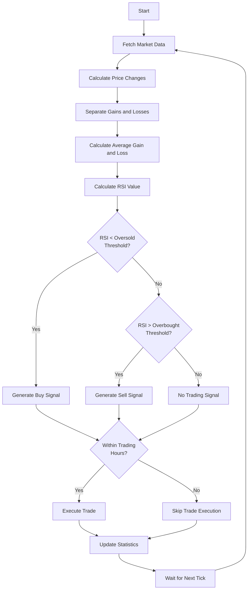

# RSI Trading Strategy

!!! danger "Trading Risk Warning"
    **IMPORTANT: All examples should be tested using demo accounts only!**

    - Trading involves substantial risk of loss
    - These examples are for educational purposes only
    - Always test with fake money before using real funds

## Overview

The Relative Strength Index (RSI) is a momentum oscillator that measures the speed and change of price movements. It oscillates between 0 and 100 and is typically used to identify overbought or oversold conditions in a market.

| Signal Type | Description |
|-------------|-------------|
| **Buy signal** | When RSI falls below the oversold threshold (typically 30) |
| **Sell signal** | When RSI rises above the overbought threshold (typically 70) |

## Strategy Logic

| Step | Description |
|------|-------------|
| 1 | Calculate the RSI indicator using price data |
| 2 | Generate buy signals when RSI falls below the oversold threshold |
| 3 | Generate sell signals when RSI rises above the overbought threshold |
| 4 | Execute trades only during specified trading hours |

### Strategy Flow



## Code Implementation

Let's break down the implementation step by step:

### Step 1: Required Imports

```python
from __future__ import annotations

import logging
import numpy as np

from mqpy.rates import Rates
from mqpy.tick import Tick
from mqpy.trade import Trade

# Configure logging
logging.basicConfig(
    level=logging.INFO,
    format='%(asctime)s - %(levelname)s - %(message)s'
)
logger = logging.getLogger(__name__)
```

We import the necessary modules:
- Core MQPy modules for trading and data access
- `numpy` for efficient calculations in our RSI function
- `logging` for tracking the strategy's operation

### Step 2: RSI Calculation Function

```python
def calculate_rsi(prices: list[float], period: int = 14) -> float | None:
    """Calculate the Relative Strength Index."""
    if len(prices) < period + 1:
        return None

    # Calculate price changes
    deltas = np.diff(prices)

    # Separate gains and losses
    gains = np.where(deltas > 0, deltas, 0)
    losses = np.where(deltas < 0, -deltas, 0)

    # Calculate initial average gain and loss
    avg_gain = np.mean(gains[:period])
    avg_loss = np.mean(losses[:period])

    # Avoid division by zero
    if avg_loss == 0:
        return 100

    # Calculate RS and RSI
    rs = avg_gain / avg_loss
    rsi = 100 - (100 / (1 + rs))

    return rsi
```

This function implements the RSI formula:
1. First, it checks if we have enough price data (at least period + 1 values)
2. It calculates price changes between consecutive closes using `np.diff()`
3. It separates the price changes into gains (positive changes) and losses (negative changes)
4. It calculates the average gain and average loss over the specified period
5. It computes the Relative Strength (RS) as the ratio of average gain to average loss
6. Finally, it converts RS to RSI using the formula: RSI = 100 - (100 / (1 + RS))

### Step 3: Initialize the Trading Strategy

```python
trade = Trade(
    expert_name="RSI Strategy",
    version="1.0",
    symbol="EURUSD",
    magic_number=568,
    lot=0.1,
    stop_loss=30,
    emergency_stop_loss=90,
    take_profit=60,
    emergency_take_profit=180,
    start_time="9:15",
    finishing_time="17:30",
    ending_time="17:50",
    fee=0.5,
)
```

We configure our trading strategy with:
- Identification parameters: name, version, magic number
- Trading parameters: symbol, lot size
- Risk management parameters: stop loss and take profit (notice the take profit is 2x the stop loss)
- Trading session times: when to start, when to stop opening new positions, and when to close all positions

### Step 4: Set Strategy Parameters

```python
# Strategy parameters
prev_tick_time = 0
rsi_period = 14
overbought_threshold = 70
oversold_threshold = 30
```

The key parameters for our RSI strategy are:
- `rsi_period`: The number of periods for RSI calculation (standard is 14)
- `overbought_threshold`: The RSI level above which we consider the market overbought (70)
- `oversold_threshold`: The RSI level below which we consider the market oversold (30)

### Step 5: Main Trading Loop

```python
try:
    while True:
        # Prepare the symbol for trading
        trade.prepare_symbol()

        # Fetch tick and rates data
        current_tick = Tick(trade.symbol)
        historical_rates = Rates(trade.symbol, rsi_period + 20, 0, 1)  # Get extra data for reliability
```

In the main loop, we:
- Prepare the symbol for trading
- Get the current market price
- Retrieve historical price data (we get rsi_period + 20 bars for reliable calculations)

### Step 6: Calculate RSI and Generate Signals

```python
# Only process if we have a new tick and enough data for RSI calculation
if current_tick.time_msc != prev_tick_time and len(historical_rates.close) >= rsi_period + 1:
    # Calculate RSI
    rsi_value = calculate_rsi(historical_rates.close, rsi_period)

    if rsi_value is not None:
        # Generate signals based on RSI thresholds
        is_buy_signal = rsi_value < oversold_threshold
        is_sell_signal = rsi_value > overbought_threshold

        # Log RSI values and signals
        if is_buy_signal:
            logger.info(f"Oversold condition: RSI = {rsi_value:.2f} (< {oversold_threshold})")
        elif is_sell_signal:
            logger.info(f"Overbought condition: RSI = {rsi_value:.2f} (> {overbought_threshold})")
        else:
            logger.debug(f"Current RSI: {rsi_value:.2f}")
```

For each new tick, we:
1. Calculate the RSI value using our custom function
2. Generate trading signals based on simple threshold comparisons:
   - Buy when RSI < oversold threshold (30)
   - Sell when RSI > overbought threshold (70)
3. Log the RSI values and any signals generated for monitoring

### Step 7: Execute Trades

```python
# Execute trading positions based on signals during allowed trading hours
if trade.trading_time():
    trade.open_position(
        should_buy=is_buy_signal,
        should_sell=is_sell_signal,
        comment=f"RSI Strategy: {rsi_value:.2f}"
    )
```

When a signal is detected:
- We check if we're within the allowed trading hours
- If yes, we execute the appropriate trade based on our signals
- The comment includes the RSI value for reference in the trading terminal

### Step 8: Update State and Check for End of Day

```python
# Update trading statistics periodically
trade.statistics()

prev_tick_time = current_tick.time_msc

# Check if it's the end of the trading day
if trade.days_end():
    trade.close_position("End of the trading day reached.")
    break
```

After processing each tick, we:
- Update the trading statistics for monitoring
- Store the current tick time for the next iteration
- Check if it's the end of the trading day, and if so, close positions and exit

### Step 9: Error Handling

```python
except KeyboardInterrupt:
    logger.info("Strategy execution interrupted by user.")
    trade.close_position("User interrupted the strategy.")
except Exception as e:
    logger.error(f"Error in strategy execution: {e}")
finally:
    logger.info("Finishing the program.")
```

Our error handling ensures:
- Proper handling of user interruptions
- Logging of any errors that occur
- Clean program termination in the `finally` block

## Full Source Code

You can find the complete source code for this strategy in the [MQPy GitHub repository](https://github.com/Joaopeuko/Mql5-Python-Integration/blob/main/docs/examples/rsi_strategy.py).

## Optimization Opportunities

This strategy can be improved by:

| Improvement | Description |
|-------------|-------------|
| **Smoothing** | Using a smoothed RSI or applying an additional moving average to filter out noise |
| **Trend Filters** | Only taking trades in the direction of the longer-term trend |
| **Divergence** | Looking for divergence between price and RSI for stronger signals |
| **Dynamic Thresholds** | Adjusting the overbought/oversold thresholds based on market volatility |
| **Position Management** | Taking partial profits when RSI reaches extreme levels |

## Next Steps

Try experimenting with:

| Experiment | Options |
|------------|---------|
| RSI Periods | Shorter periods (9) for more signals, longer periods (21) for fewer but stronger signals |
| Threshold Levels | Test different levels like 20/80 for stronger signals but fewer trades |
| Complementary Indicators | Add moving averages or other oscillators to confirm RSI signals |
| Position Sizing | Implement different sizing based on the distance of RSI from thresholds |
